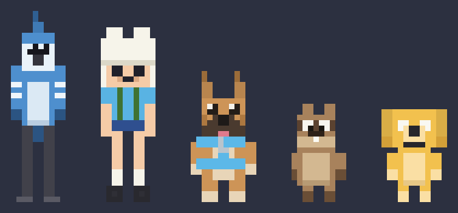
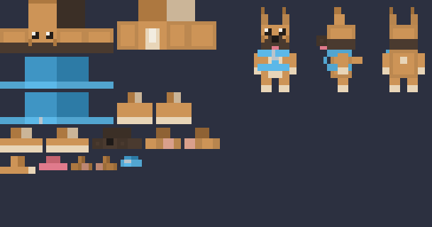
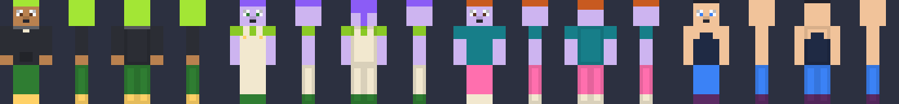
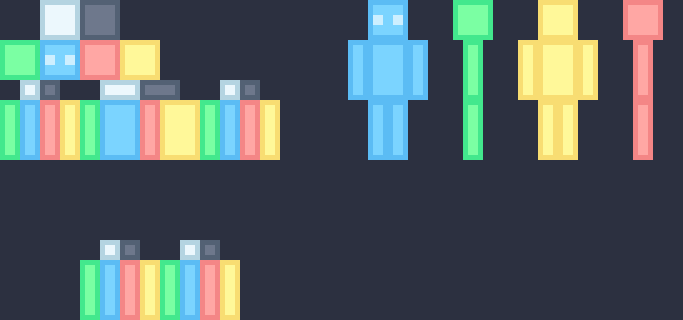

# bongle-avatar

Generate pixel-art avatars for [bongle.io](https://bongle.io) from Python — box
models, UV atlases and ready-to-open Blockbench projects, all from code.



No 3D modelling by hand. You declare boxes and paint their faces; the toolkit
packs the texture atlas, builds the bone rig bongle requires, and writes a
`.bbmodel` with the texture embedded so it opens ready to use.

## Quickstart

```bash
pip install -r requirements.txt
```

```bash
python bongle_model.py all --preview
```

That writes `models/` — a PNG atlas, a `.bbmodel` project and front/side/back
preview elevations for each of the three built-in characters. Open any
`.bbmodel` with `File → Open` in [Blockbench](https://blockbench.net), or drag it
into [web.blockbench.net](https://web.blockbench.net) or the bongle editor.

## The bongle rig (read this first)

bongle's editor embeds Blockbench and validates every model against a fixed bone
hierarchy. **Bones are matched by name.** Miss one and the editor rejects the
model — and, more confusingly, the geometry still looks fine in the editor while
the parts come apart in the game viewer.

```
waist
  body
    back        (optional)
  head
  arm_left
    hand_left   (optional)
  arm_right
    hand_right  (optional)
leg_left
leg_right
```

`leg_left` and `leg_right` sit at the **root**, not under `waist`. That one
catches people out.

You don't have to remember any of it. `bongle_model.py` reproduces this
validation locally and **refuses to export** a model bongle would reject,
naming exactly which bones are missing or misparented:

```
otis_custom: Bongle would reject this rig:
  missing required bone "waist" (must be at the root)
  missing required bone "head" (must be a child of "waist")
```

## The tools

### `bongle_model.py` — custom-proportioned characters

The main event. Arbitrary box sizes, positions and rotations, an atlas packed
for you, and the bone rig built in.

```bash
python bongle_model.py otis --preview          # one character
python bongle_model.py all --preview --bg "#2c3040"
```



| character | boxes | height | notes |
| --- | --- | --- | --- |
| `finn` | 15 | 32 units | bear hat as real geometry, backpack in the optional `back` bone |
| `otis` | 16 | 24 units | staffy build, upright pointy ears, harness as three boxes |
| `jake` | 10 | 17 units | floppy ears rotated 22° outward, tail angled up |

Because rotation is per-box, ears really flop and tails really angle — things a
flat Minecraft skin cannot express.

### `bongle_skin.py` — 64×64 Minecraft-format skins

For the vanilla humanoid rather than custom geometry. Writes a standard 64×64
skin atlas: base plus overlay layer, classic (4px) or slim (3px) arms.

```bash
python bongle_skin.py character --count 8 --preview
python bongle_skin.py preset finn --preview
python bongle_skin.py uvkey --preview
```



`uvkey` paints an orientation key — one hue per facing, eye marks on the front —
which is the fastest way to confirm a model's UVs are mapped correctly:



Green is the model's right, blue the front, salmon the left, yellow the back,
white on top, slate underneath. Anything rotated or mirrored shows up instantly.

```bash
python bongle_skin.py verify path/to/some_skin.png
```

`verify` diffs that key against a reference atlas and reports whether it matches
exactly, per arm width — which is also how you identify whether an unknown skin
uses classic or slim arms.

### `make_bbmodel.py` — wrap a skin in a Blockbench project

```bash
python make_bbmodel.py skins/finn.png
```

Takes any 64×64 skin PNG and produces a `.bbmodel` with the humanoid boxes, both
layers, and the texture embedded. Overlay cubes are inflated the way the game
inflates them — 0.5 for the hat layer, 0.25 for the rest.

### `inspect_sheet.py` — measure someone else's sheet

```bash
python inspect_sheet.py sheet.png
python inspect_sheet.py sheet.png --cell 16x24
```

Reports image size, block-upscale factor, palette by frequency, flat separator
rows and columns, and with `--cell` each cell's tight content bounds. Use it to
work out a sheet's grid before writing a generator to match it.

## Claude skills

If you use [Claude Code](https://claude.com/claude-code), this repo ships skills
in `.claude/skills/` so you can work in plain language instead of remembering
flags:

| skill | what it does |
| --- | --- |
| `/bongle-character` | add or edit a character — geometry, painting, rig, export, verify |
| `/bongle-skin` | generate or hand-author 64×64 Minecraft-format skins |
| `/bongle-fix-import` | diagnose a model bongle rejects or renders wrongly |

For example: *"add a character called luna, a small grey cat, 20 units tall"* —
`/bongle-character` covers the box layout, the rig wiring and the export checks.

## Adding your own character

One function, registered in `CHARACTERS`:

```python
def build_luna() -> Model:
    m = Model("luna_custom")

    # 1. Boxes. Sizes must be whole numbers (one texel per unit);
    #    positions and pivots may be fractional.
    m.add("torso", start=(-3, 4, -2), size=(6, 7, 4), origin=(0, 4, 0))
    m.add("head", start=(-4, 11, -4), size=(8, 7, 8), origin=(0, 11, 0))
    m.add("ear_left", start=(2, 18, -1), size=(2, 3, 2),
          origin=(3, 18, 0), rotation=(0, 0, -15))   # rotation is real geometry
    # ... legs, arms

    # 2. The rig. Every box belongs to exactly one bone.
    m.bone("waist", None, (0, 4, 0))
    m.bone("body", "waist", (0, 4, 0), ["torso"])
    m.bone("head", "waist", (0, 11, 0), ["head", "ear_left"])
    # ... arm_left, arm_right, leg_left, leg_right

    # 3. Pack, then paint. pack() assigns UV islands and sizes the atlas.
    m.pack()
    m.fill("torso", "#8a8f98")
    m.face("head", "front").rect(1, 2, 2, 3, "#ffffff")
    return m


CHARACTERS = {..., "luna": build_luna}
```

Then `python bongle_model.py luna --preview`.

Three checks run before anything is written, so mistakes surface here rather
than in the game viewer:

- `bone_issues()` — the rig bongle demands, including orphaned boxes
- `overlaps()` — atlas islands colliding
- `unpainted()` — faces left fully transparent

### Painting

`m.face(box, face)` returns a view with face-local coordinates, so you never
compute atlas offsets by hand:

```python
m.face("torso", "front").rows(0, 2, "#59b3e3")   # top three rows
m.face("head", "front").rect(1, 2, 2, 3, "#ffffff")
m.face("head", "left").shade_edges(0.1)          # darken the 1px rim
```

Faces are `top`, `bottom`, `left`, `right`, `front`, `back` — the character's
own left and right, not the viewer's.

### A note on previews

`--preview` elevations are exact for heights and widths but **do not apply
rotation**, so floppy ears appear straight. Check rotation in Blockbench.

## Project layout

```
bongle_model.py            custom-proportioned characters + the bongle rig
bongle_skin.py             64×64 Minecraft-format skin atlases
make_bbmodel.py            wrap a 64×64 skin PNG in a .bbmodel
inspect_sheet.py           measure an existing sprite sheet
examples/build_examples.py regenerates the images in this README
extras/bongle_avatar.py    2D standing sprites — unrelated to bongle, kept as a standalone toy
.claude/skills/            Claude Code skills
```

Output goes to `models/` and `skins/`, both gitignored — everything there is one
command away from being regenerated.

## Requirements

Python 3.10+ and [Pillow](https://pillow.readthedocs.io). Nothing else.

## Credits

Finn and Jake are fan renditions of characters from *Adventure Time*, made for
personal use. Otis is my dog.

## License

MIT — see [LICENSE](LICENSE).
